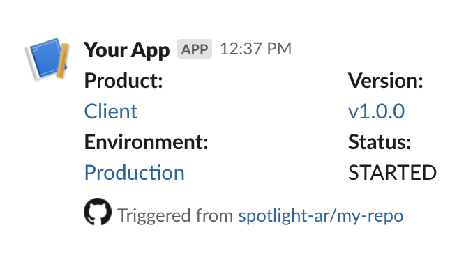

# github-action-slack-notify-deploy

Github action to send a Slack message during a deploy. Specifies the product being deployed, what version is being deployed, the environment being deployed to, and the status of the deployment.

## Usage

```
uses: spotlight-ar/github-action-slack-notify-deploy@v1.0
with:
  channel: 123456
  status: STARTED
  product: Client
  version: v1.0.0
  environment: Production
  environment_url: https://production.example.com
env:
  SLACK_BOT_TOKEN: ${{ secrets.SLACK_BOT_TOKEN }}
```



## Variables

### Inputs:

| Variable        | Description                                       | Required? |
| --------------- | ------------------------------------------------- | --------- |
| channel_id      | The Slack channel ID to send the message to.      | true      |
| product         | The name of the product being deployed.           | true      |
| version         | The version of the product being deployed.        | true      |
| environment     | The environment the product is being deployed to. | true      |
| environment_url | The URL for the environment being deployed to.    | false     |
| status          | The status to list in the update.                 | true      |
| message_id      | The ID of the existing Slack message to update.   | false     |

### Outputs:

| Variable   | Description                                                |
| ---------- | ---------------------------------------------------------- |
| message_id | The unique timestamp identifier of the Slack message sent. |

### Secrets:

| Variable        | Description                                |
| --------------- | ------------------------------------------ |
| SLACK_BOT_TOKEN | The Slackbot token to use for this actions |
